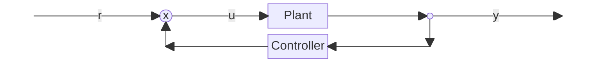

## 📢Precaution

{: .prompt-info}

> 본 게시글은 서울대학교 심형보 교수님의 23-2 제어공학개론 수업 내용을 바탕으로 작성되었습니다.

## Definition of "Control"

### 제어의 과정 : Modeling, Analysis, Synthesis

- 제어
: 원하는 출력을 얻기 위해 입력을 설계하는 것
- 제어를 위한 대상이 입력과 출력을 가지고 있어야 함.

### A simple example

> 드론을 제어한다고 할 때 일정 높이 (1m for example)  에 hover하려면 드론의 모터의 입력을 설계하는 것

- Plant, System
: 드론과 같이 제어의 대상이 되는 것.
- Controller
: 제어를 위해 (주로) feedback의 형태로 출력신호를 받아 입력신호에 반영시켜주는 것.

## Block diagram : 제어의 추상화

Flow chart와 같이 제어를 block diagram으로 추상화하여 나타낼 수 있는데, 입력 신호와 출력 신호와 같은 신호를 선으로, 제어기와 플랜트를 직사각형의 block 형태로 표시한다.

신호가 합쳐지는 Conjunction의 경우에는 ⓧ 로, 신호가 나뉘어지는 부분에서는 $\cdot$ 으로 표시함.





### 실제 세계에 대한 Modeling의 필요성

드론의 예시를 실제 세계로부터 Modeling 하면, 지표면으로부터의 높이를 system의 출력에 해당하는 $y(t)$로 놓고, 인가하는 힘을 $u(t)$로 놓을 수 있다.

이 상태에서 $F=ma$ 라는 뉴턴의 제 2법칙으로부터 하나의 미분방정식을 얻어낼 수 있다.


$$
\begin{equation}u(t)-mg = m\ddot y(t)\end{equation}
$$


입력변수 $u(t)$에 따라 출력변수 $y(t)$의 2번 미분된 값, 즉 가속도가 결정되는 미분방정식이다. 

미분방정식을 해결하기 위해 초깃값을 알아야 하는데, $y(0), \ \dot y(0)$는 각각 0초, 즉 초기 상태의 드론의 높이와 속도이다. 

그 다음은, 드론이 실제로 따라갔으면 하는, desired height $y^*(t)$에 대한 그래프를 그려볼 수 있다. 불연속적으로 오르는 것 보다는 연속적으로 부드럽게 오르는 것이 좋아 보이므로, 이를 반영하여 그래프를 그려보면,

### Command

_시간에 따라 초기 위치에서 최종 위치로 부드럽게 올라가는 desired height graph_

이 때의 $y^*(t)$를 **Command**, 혹은 **Reference**라고 함.

Initial value를 알고, command를 알면, 이제 $u(t)$를 간단히 구할 수 있다. 먼저는 Command를 2번 미분한 $\ddot y^* (t)$를 (1)의 $\ddot y$에 대입하면 된다.

### 제어의 필요성

제어를 이용하지 않고도 이미 1m 높이에서 hovering하기 위한 입력 $u(t)$를 알아냈기에 제어 없이도 문제를 해결한 것 같아 보이지만,  크게 2가지 정도의 문제점이 산재해 있다.

1. 우리가 이미 아는 값이라고 간과하고 있는 질량 $m$의 불확정성이 있다. 실제 질량이 $m$, 측정된 질량이 $m'$이라 하면 1m에 도달한 이후에 인가되는 힘 $u(t) = m'g\neq mg$ 이므로, 1m를 유지하지 못하고 아주 조금씩 위나 아래로 벗어나게 된다.
2. **Purturbation**, **Disturbance**가 고려되지 않았다. 드론의 예시에서는, 누군가 드론을 툭 치거나, 이동하면서 받는 공기의 저항, 바람과 같이 외부에서 작용할 수 있는 요소들이 고려되지 않았다.

공기 저항 의 크기는 속도에 비례하므로 modeling에 추가할 수 있다. 또 바람의 경우에도 풍향계와 풍속계를 드론에 달아 추가로 sensing한다면, 이 또한 modeling을 통해 포함시킬 수는 있다. 

반대로 누가 툭 치는 행위, 전기적 신호의 noise와 같은 것들은 modeling자체가 불가능한 경우도 있습는데, 어떤 이유에서든 modeling에 포함시키지 않은 요소와 포함시킬 수 없는 요소들에 의해 disturbance(외란)이 발생한다.

이러한 이유에서 (1)을 풀어 $u(t)$를 구하는 단순한 방법을 적용하면 실제 세계에 부합하지 않게 된다.

## Feedback

Feedback은 이러한 물리량의 측정 오류에 의한, 외란에 의해 생기는 오차들을 줄일 수 있는 방법이다. Feedback 자체에 대한 정의는 우리 일상에서의 '피드백'의 정의와 비슷한데, 여기서는 $y(t)$의 측정 값을 이용해 $u(t)$의 값을 업데이트 하는 것이라고 간단히 요약할 수 있다.

### Feedback의 기능

Feedback을 위해서는 Sensor를 통해서 현재 높이인 $y(t)$값을 알아내야 하므로 sensing을 하여 알아내야 한다. Feedback은 크게 2가지의 역할을 담당하는데,

1. System의 Robustness(강인성)을 증가시켜준다. 위 제어의 필요성과 일맥상통하는 부분으로, 작은 purturbation이나 외부로부터 오는 disturbance에도 system이 빠르게 Desired $y^* (t)$로 복귀할 수 있도록 하는 것이 피드백이다.
2. System 자체의 Dynamics를 바꿔준다.

앞의 드론을 예시로 어떻게 System 자체의 Dynamics에 Feedback이 관여할 수 있는지를 알아보자면,

$y(t)$ 라는 높이를 Sensor를 통해 측정하여 이 정보를 알고 있다고 가정하고 원래의 지배방정식을 다시 써보면,


$$
\begin{equation}m\ddot y = u-mg\end{equation}
$$


여기서 정확한 질량 $m$, (더하여 중력가속도 $g$)를 알지 못하기 때문에, 대략적인 Approximation 값인 $\bar{mg}$를 이용할 수 있다. 다만, 이제는 $y(t)$를 알기 때문에 $y(t)$, 그리고 이를 미분한 $\dot y(t)$도 사용할 수 있다. 이를 이용해서 $u(t)$를 만드는 것도 가능하다.


$$
\begin{equation}u(t) = -c\dot y(t) -ky(t)+\overline{mg}\end{equation}
$$


다음과 같이 sensor로부터 얻어낸 신호를 이용해서 다음과 같이 $u(t)$를 만들어 볼 수 있다. (3) 식을 (2)에 다시 대입해보면,


$$
\begin{equation}m\ddot y + c\dot y + ky = \overline{mg} - mg\end{equation}
$$


다음과 같은 Mass-Spring-Damper의 2차 미분방정식으로 system의 지배방정식이 바뀐 것을 알 수 있다.  단지 $F=ma$에서 비롯되었던 식이 Feedback을 통해 (4)과 같이 그 Dynamics 자체가 바뀌었다는 것을 알 수 있다.

System의 Dynamics를 건드린다는 것은, 그 system의 stability(안정도)를 검토해 봐야한다는 뜻이기도 하다. 미분방정식의 입장에서는 해가 발산하는 경우, 즉 실제 세계에서는 갑자기 드론이 땅에 박거나 하늘로 치솟는 경우를 말한다.

### Dynamic vs Static System

Dynamics, 이름 그대로 역학 시스템이라고 해석해도 무방하기는 하나, 정확히는 자연계로부터 모델링되는 이 Dynamic system은 Static system과 대치되는 단어로 볼 수 있다.

Dynamic system과 Static system은 간단히 설명하자면 Memory의 여부에 따라 결정된다. 위 시스템에서는 2개의 $\ddot y(t)$가 등장하므로 적분기가 존재하는 것으로 볼 수 있고 적분기라는 것은 초기상태로부터 지금까지의 정보를 담는 Analog Memory라고 볼 수도 있다. 

정보의 저장 없이 단순히 입력으로부터 출력을 내는 Static system와의 차이가 여기서 발생하는데, 예를 들어 $u(t)$의 값을 3배 하여 $y(t)$로 출력하는 System이 있다면, 이는 Static system이다. 값을 바로 도출해내므로 메모리가 필요 없고 입력받은 즉시 출력하는 (instant response) 시스템이다.

