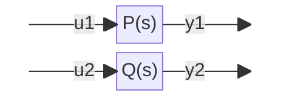
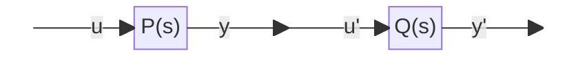
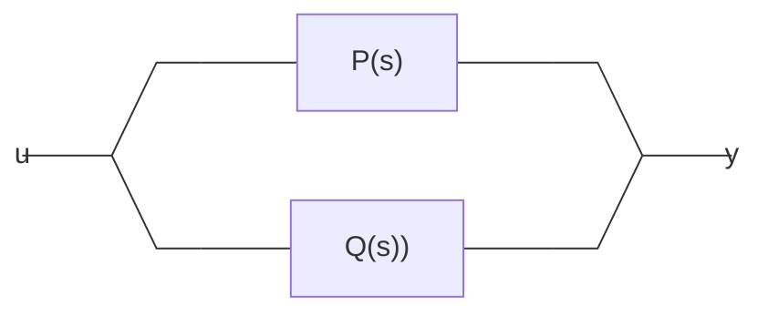
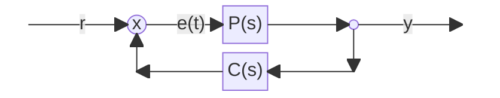

## 📢Precaution

{: .prompt-info}

> 본 게시글은 서울대학교 심형보 교수님의 23-2 제어공학개론 수업 내용을 바탕으로 작성되었습니다.

## Modeling의 방법

대략 3가지의 modeling 방법을 배우고자 하는데, 각각 differential equation, transfer function, state-space representaion이 있다.

### Differential Equation

이 방법은, 실제 시스템을 그대로 모델링하여 differential equation으로 나타낸 것. 드론의 예제에서 $F=ma$를 이용하여 바로 식을 세운 것이 differential equation임.


$$
\begin{equation}u(t)-mg = m\ddot y(t)\end{equation}
$$


- 장점 : 한눈에 봤을 때 물리적 의미가 드러남
- 단점1 : 여러 시스템을 연결, 해석에 불편함이 따름. 후술할 방법을 위한 수식의 원형에 가까움
- 단점2 : $u(t)$가 주어졌을 때 $y(t)$를 evaluate 하는 것이 어려움. 시스템이 수행하는 동작을 따라 $y(t)$를 구하려면 식 (1)에 대입하여 $\ddot y(t)$를 알아내고 이를 2번 적분하여 얻어내는 방법밖에 없음.

### Transfer Function


$$
T(s) = \frac{Y(s)}{U(s)} = \frac{\mathcal{L}(y(t))}{\mathcal{L}(u(t))}
$$


Transfer function의 정의는 Input Laplace 변환에 대한 Output Laplace 변환의 비이다. 

Definition of Laplace transform :

> If $f(t)$ is a function defined for all $t\leq 0$, its Laplace transform is in the integral of $f(t)$ times $e^{-st}$ from $t=0 \text{ to }\infty$ . It is a function of s, say, $F(s)$, and is denoted by $\mathcal{L}(f)$; thus


$$
\begin{equation}F(s) = \mathcal{L}(f) = \displaystyle\int_0^\infty e^{-st}f(t)dt\end{equation}
$$


_Source : Kreyszig 공업수학 10th ed. p. 204_

단순히 Laplace transform을 통해 풀기 어려운 ODE를 해결하는 것에서 그치는 것이 아니라, Transfer function은 시스템의 안정도 등 제어공학에서 여러 유용한 정보를 포함하고 있다.

- 장점1 : Differential equation과 달리 여러 시스템의 연결이 용이함.
- 장점2 : $y(t)$ 를 evaluate하기가 매우 편함.
- 단점 : Transfer function 자체가 s-domain의 식이므로, 비직관적임

### State-space representation

상태변수 표현법, “state(상태)”의 개념이 나오는데, 이후에 다루도록 한다.

## Benchmark Problem : 3-cart

질량이 $m_1, m_2, m_3$ 인 cart, spring constant가 $k_1, k_2$인 용수철에 의해 연결되어 있다.

Damping constant가 $c_1, c_2, c_3$ 인 damper 또한 연결되어 있음.

Cart 1에 $u(t)$의 힘을 인가할 때, 각각의 cart가 임의의 시간에서 임의의 위치, 임의의 속도를 가지도록 하는 $u(t)$를 찾는 것이 benchmark problem.

추가적으로 외란(disturbance)의 존재나 system 자체를 구성하는 variable, $m_i, k_j, c_p$ 등의 값에 불확정성이 있는 경우에도 제어가 가능한가.

조금 더 디테일을 추가하여,

> $t=10$ 에서 Cart 3 가 1m 앞으로 간 상태에서 정지하도록 하는 제어 입력 $u(t)$를 구하자

### Modeling benchmark problem

각각의 Cart에 작용하는 힘의 합력을 뉴턴의 제 2법칙을 이용하여 모델링 하자.


$$
\begin{equation}\begin{aligned}

m_1 \ddot p_1 &= u(t)-k_1(p_1-p_2)-c_1\dot p_1\\
m_2 \ddot p_2 &= k_1 (p_1-p_2) -k_2 (p_2-p_3) -c_2 \dot p_2\\
m_2 \ddot p_2 &= k_1 (p_1-p_2) -k_2 (p_2-p_3) -c_2 \dot p_2\\
m_3 \ddot p_3 &= k_2 (p_2-p_3) -c_3 \dot p_3\\
y &= p_3
\end{aligned}\end{equation}
$$


우리가 알고자 하는 것(출력)은 $p_3$이므로, $y=p_3$로 둘 수 있음. 

방향에 대한 notation : 

> 기본적으로 왼쪽 방향을 ( + ) 방향으로 놓았다는 사실을 인지한 상태에서 ,일단 방향을 고려하지 않고 $p_1-p_2$의 index 순서대로 쓴 다음, $p_1$이 더 왼쪽으로 가면, $p_1$이 커지는 방향이고, $p_1-p_2$의 값은 양의 방향으로 증가한다. 이 때 두 Cart 간의 거리는 증가하므로 Cart 1은 오른쪽(음의 방향)으로 받는 힘이 커진다. 변위에 곱해질 값은 $-k_1$이 된다.  
> Damping의 경우는 항상 운동방향의 반대로 작용하므로 ( - )를 붙였다고 생각한다.

Modeling과 Field knowledge의 상관관계 : Modeling에서 우리가 사용한 것은 뉴턴의 제 2법칙과 용수철 상수에 대한 식($F=kx$) 이다. 모델링 대상에 대한 Field Knowledge를 알고 있어야만 적절한 모델링이 가능하다. 또다른 예시로 탄도학(Ballistics)을 모델링 하려면, 유체역학적 지식과, 속도 조건에 따라 아음속, 혹은 초음속에서의 압축성 유동에 대한 Field Knowledge 등이 필요할 것이다.

## Transfer function

입력 $u$를 받아 $y$를 출력하는 시스템이 대한 Transfer function은 다음과 같이 기술된다.


$$
\begin{equation}T_{u\rightarrow y}(s) := \displaystyle\frac{{\mathcal L}(y(t))}{{\mathcal L}(u(t))} = {Y(s) \over U(s)}\end{equation}
$$


Transfer function은 모든 초깃값이 0일 때의 출력 신호의 라플라스 변환을 입력 신호의 라플라스 변환으로 나눈 것으로 정의된다. 이 때 모든 초깃값이 0이라는 점은, 입력 신호 $u(t)\equiv 0 \text{ for } t<0$을 의미한다. 입력 신호가 $0$이므로, 당연히도 출력값 $y(t)$도 $0$을 가리키게 된다.

### D. E. to T. F.

Differential equation이 주어졌을 때 Transfer function을 구하는 방법이다. 다음과 같은 Differential Equation을 생각해보자.


$$
\begin{equation}a_n y^{(n)}(t) + \cdots + a_1 y^{(1)}(t) + a_0 y(t) = b_m u^{(m)}(t)+ \cdots + b_1 u^{(1)}(t)+b_0 u(t)\end{equation}
$$


$y$의 최대 $n$차 도함수와 $u$의 최대 $m$차 도함수간에 선형적인 결합으로 이루어진 differential equation. 


$$
\begin{equation}\text{let } {\mathcal L}\{y(t)\}=Y(s)\\{\mathcal L}(\dot y)= sY(s)-y(0^-)\end{equation}
$$


초깃값은 Transfer function의 조건에 의해 0으로 둘 수 있다. 이 때 초깃값은 $y(0^-)$로 0보다 살짝 왼쪽의(작은) 값으로 써주었는데, 이는 $0+, 0-$ 양쪽 방향에서 **Direc's Delta function**을 극한으로 보낼 때 값을 보정하기 위함이라, 수학적인 극한의 이유에서 저렇게 쓴것이라 생각해도 무방.

식 (6)로부터 알 수 있는 사실은 time domain에서의 미분은, s-domain에서 본래의 함수에 s를 곱하는 것으로 처리된다는 점이다. 정의부터, 계산까지 하나같이 어려운 미분을 s-domain에서 이렇게 쉽게 계산할 수 있다는 점이, s-domain의 장점이다.


$$
\begin{aligned}\text{let } {\mathcal L}\{y(t)\}=Y(s)&,{\mathcal L}\{u(t)\}=U(s)\\
\bigg(a_n s^n + \cdots + a_1 s + a_0 \bigg)Y(s) &= \bigg(b_m s^m + \cdots + b_1 s + b_0 \bigg)U(s)\\
\therefore T_{u\rightarrow y} =\displaystyle\frac{Y(s)}{U(s)}&= \frac{\displaystyle\sum_{j=0}^m b_j s^j}{\displaystyle\sum_{i=0}^n a_i s^i}\end{aligned}
$$


원래 ODE 입출력 각각의 $n$th derivative의 coefficient가 Transfer function에서의 $s^n$의 계수임.

또한 원래의 differential equation의 출력 $y(t)$와 그 도함수들의 계수 $a_i$는 Transfer function의 분모로, 입력 $u(t)$와 그 도함수들의 계수 $b_j$는 Transfer function의 분자로 이동한 것을 알 수 있다.

Transfer function은 선형이고, 시불변일 때 (Linear, Time Invarient) 그 값이 일정하다. 여기서 선형(Linear), 시불변(Time Invarient)라는 2가지 조건이 만족되어야지만 Transfer function이 일정한 값을 가지고 valid해진다. 이를 짧게 줄여 **LTI system**이라고 한다.

### 선형(Linear)

시스템이 선형이라는 것은, 수학에서의 선형성의 조건과 거의 일치한다. 

- 입력 $u(t)$에 대한 출력이 $y(t)$인 system에 $ku(t)$를 입력하면 $ky(t)$가 출력됨
- $u_1(t)+u_2(t)$의 입력에 대해서는 각각의 출력의 합인 $y_1(t)+y_2(t)$이 출력됨

Transfer function의 입장에서 시스템이 선형이라는 것은, 내가 입력하는 $u(t)$, 입력에 따라 Transfer function이 달라지지 않는다는 것을 의미한다. Non-linear한 경우 주어지는 입력값에 따라 Transfer function이 달라지며, 이러한 시스템은 너무 어려워 따로 Nonlinear system 과목에서 다룬다. 

### 시불변(Time Invarient)

시불변이라는 것은, input이 입력된 시점에 관련 없이 출력이 동일하게 나온다는 것을 의미한다. 

0초에 $u(t)$를 인가하여 $y(t)$를 얻었다면, $\sigma$초 delay된 입력 $u(t+\sigma)$에 대한 출력으로 $y(t+\sigma)$를 기대할 수 있다는 것이다. 

특정 시간에 varient한 것이 아니라, 동일 state(initial condition)에서 동일한 입력에 대해 동일한 response를 보이는 것으로 이해할 수 있음.

Transfer function의 입장에서 Time invarient하다는 것은, 원래의 differential equation의 계수가 time-invarient함을 의미한다. 계수들이 $\big(a_i(t), b_i(t)\big)$로 시간에 따라 바뀌는 system은 time-varient한 system이라고 볼 수 있다. 이러한 time varient system 또한 여기에서 다루지 않는다.

### Transfer function의 종류

- Rational transfer function
: Transfer function과 같이 transfer function의 분자와 분모를 다항식으로 나타낼 수 있는 transfer function을 rational transfer function이라고 부른다. 
당연히도, Rational transfer function이면 LTI system이다.
- Proper, bi-proper transfer function
	- 위 예시에서 $n, m$은 각각 $y, u$의 미분 차수의 최고차수이다.
	- $n>m$인 경우 : proper transfer function
	- $n=m$인 경우 : bi-proper transfer function
	- $n<m$인 경우는 본 강의에서 다루지 않는다.
- Time delay system
Laplace 변환의 T-shifting으로부터 $f(t-a)$의 Laplace transform은 $e^{-as}F(s)$임을 알고 있음.
이로부터, Transfer function 자체가 $e^{-as}$라면, $a$만큼의 delay를 주는 system으로 이해할 수 있다.


$$
\begin{aligned}T(s) &= e^{-as}\\
	y(t) &= u(t-a)\end{aligned}
$$


## Connecting TF

### 직렬 연결





$P(s)$와 $Q(s)$를 직렬연결하면, Transfer function은 두 TF의 곱이므로 최종 transfer function은 $P(s)Q(s)$임. 






$$
T(s) = P(s)Q(s)
$$


### 병렬 연결





_Flowchart mermaid로 그리긴 포기해야겠다.._

병렬로 연결한다는 것은 결국 $u(t)$를 각각의 plant에 똑같이 입력시키고, 출력한 신호 $y_p(t)$, $y_q(t)$를  병합한다는 의미. Transfer function의 정의를 생각하면 각각의 transfer function의 정의로부터 두 신호의 합은 TF의 합이라는 사실을 도출해낼 수 있다.


$$
T(s) = P(s) + Q(s)
$$


### Feedback System





P(s)의 앞에 보조변수$e(t)$를 하나 두어서 Feedback system의 Transfer function 계산 가능.

Feedback된 값을 원래의 입력 $u(t)$와 합친 이후에 실제로 $P(s)$에 들어가는 입력을 $e(t)$, 그 신호의 Laplace 변환을 $E(s)$라고 하면,

$P(s), C(s)$의 정의로부터,


$$
\begin{equation}\begin{aligned}
&P(s) = \displaystyle\frac{Y(s)}{E(s)} \\ \\
&C(s) = \displaystyle\frac{U(s)-E(s)}{Y(s)}\end{aligned}\end{equation}
$$


여기서 보조변수 $E(s)$를 소거하고, 전체 출력에 대한 전체 입력의 TF를 구하면,


$$
\begin{equation}\begin{aligned}
E(s) &= U(s)-C(s)Y(s) \\
Y(s) &= P(s)E(S)\\
T(s) &= \displaystyle\frac{Y(s)}{U(s)} = \frac{P(s)}{1+P(s)C(s)}
\end{aligned}\end{equation}
$$


$E(s)$가, $U(s)$에서 Controller의 출력, 즉 $C(s)Y(s)$ (Controller의 TF와 출력의 Laplace Transform의 곱)을 제하였음.

Feedback된 값에 ( - ) 부호를 붙여 negative feedback 하였기에 뺀 것.

## Using Laplace Transform

Transfer function으로부터 $u(t)$, 혹은 $y(t)$를 구하려면 Laplace transform과 그 Inverse를 수행해야 하나, Laplace transform에 대한 유용한 성질을 이용해 계산을 안하거나 간략화할 수 있음.

### Convolution

두 함수의 Convolution은, 각각의 Laplace transform의 곱이다.


$$
\begin{equation}\begin{aligned}
\text{(convolution) }(f* g)(t) &\leftrightarrow F(s)G(s)\\
(f* g)(t) &:= \displaystyle\int_0^t f(\tau) g(t-\tau)dt
\end{aligned}\end{equation}
$$


### Impulse response

만약 Transfer function에 Impulse($\delta(t)$)를 입력하면, 


$$
\begin{equation}\begin{aligned}
Y(s) &= P(s)U(s) = P(s) \times 1 \\
y(t) &= p(t)\end{aligned}\end{equation}
$$


식 (10)과 같이 디락 델타함수의 Laplace transform은 $1$이기 때문에, 출력값은 Transfer function의 inverse transform이 된다.

입력 신호로 Dirac's delta function을 인가하면, TF의 역변환을 얻어내므로, system에 대한 모든 정보를 디락델타함수 하나의 입력으로 (물리적으로 해석하면 매우 세게 시스템을 한대 쳐서) 얻어낼 수 있다.

### Laplace transform 공식들


$$
\begin{aligned}
u(t)&\leftrightarrow 1/s \\
t\cdot u(t) &\leftrightarrow 1/s^2 \\
t^n \cdot u(t) &\leftrightarrow \displaystyle n! / s^{n+1} \\
e^{-\alpha t} &\leftrightarrow \displaystyle\frac 1 {s+a}\\
\sin\omega t &\leftrightarrow \displaystyle\frac{\omega} {s^2+\omega^2}\\
\cos\omega t &\leftrightarrow \displaystyle\frac{s} {s^2+\omega^2}\\
f(t-a) &\leftrightarrow e^{-as}F(s)
\end{aligned}
$$


### Concrete example

Consider following system :


$$
P(s) = \displaystyle\frac{1}{s+1}, \ u(t) = \sin{\omega t}
$$


위와 같은 Plant에 $\omega$의 주파수를 가진 사인파를 인가하면 어떻게되는지, Laplace transform을 적용하면,


$$
\begin{aligned}
Y(s) = U(s)P(s) &= \displaystyle\frac{\omega}{\omega^2+s^2} \times \frac{1}{s+1}\\
&= \displaystyle\frac{A}{s+1} + \frac{Bs+C}{s^2+\omega^2}

\end{aligned}
$$


Taking Inverse Laplace Transform,


$$
y(t) = Ae^{-t}+ B \cos{\omega t} + \displaystyle\frac{C}{\omega} \sin{\omega t}
$$


위 식에서 A, B, C는 항등식으로부터 계산가능한 '미정계수'

- $\omega$의 주파수를 갖는 입력에 대해서 출력의 주파수 또한 $\omega$를 유지함.
첫 번째 항 $Ae^{-t}$는 시간의 흐름에 따라 $0$으로 수렴하므로, 두 번째와 세 번째 항은 주파수가 $\omega$임.
- $\cos,\sin$으로 이루어진 같은 주파수 항들은 공식에 의해 하나로 합성이 가능하다. 이 때 주파수에는 변화를 주지 않지만, $\phi$의 위상 변화가 생길 것이고, Magnitude 또한 바뀜.
- 위상차, Magnitude 두 값은 $B$,  $\displaystyle\frac{C}{\omega}$ 에 의해서 결정되므로, 입력 신호의 주파수에 영향을 받는다
- $Ae^{-t}$ 라는 항은 입력 신호가 아닌 System 자체에서 비롯된 것임.
System 자체의 정보를 담고있는, 하지만 시간이 지남에 따라 0으로 수렴해 가는 항들을 **Transient**(일시적인) 이라고 불리며, 반대로 주기성을 가지고 오랜 시간이 흘러도 남아있는 항들을 **steady-state response**라고 부름.

## Partial Fraction Expansion

대부분 Transfer function들은 Rational function이므로, Partial Fraction Expansion(부분분수 분해)을 이용해 쉽게 차수를 낮출 수 있다. Technical하게 미정계수법을 수행하는 간단한 예시를 확인하고, 이를 공식화하였다.

다음과 같은 $Y(s)$를 Partial Fraction Expansion 하자.


$$
Y(s) = \displaystyle\frac{(s+3)}{(s+2)(s+1)} = \frac{A}{s+1} + \frac{B}{s+2}
$$



$$
\begin{aligned}
A &= \displaystyle\left.\frac{s+3}{s+2}\right\vert_{s=-1}\\B &= \displaystyle\left.\frac{s+3}{s+1}\right\vert_{s=-2}
\end{aligned}
$$


통분을 해서 A와 B를 구할 수도 있지만,  위와 같은 공식에 의해 계산이 가능.

A는 $\displaystyle\frac{1}{s+1}$ 의 계수이므로, 원래의 식에서 해당 부분을 제외하고 나머지 값에 $\displaystyle\frac{1}{s+1}$의 분모를 0으로 만드는 $s=-1$을 대입하여 구할 수 있다.

중근(Repeated roots)의 경우


$$
Y(s) = \displaystyle\frac{(s+3)}{(s+2)(s+1)^3} = \frac{A}{s+1} + \frac{B}{s+2}+\frac{C}{(s+1)^2}+\frac{D}{(s+1)^3}
$$



$$
\begin{aligned}
D = \displaystyle\left.\frac{s+3}{s+2}\right\vert_{s=-1} \\
B = \displaystyle\left.\frac{s+3}{(s+1)^3}\right\vert_{s=-2}\\
C = \displaystyle\left.\big(\frac{d}{ds}\frac{s+3}{s+2}\big)\right\vert_{s=-1}\\
A = \displaystyle\left.\frac{1}{2}\big(\frac{d^2}{ds^2}\frac{s+3}{s+2}\big)\right\vert_{s=-1}
\end{aligned}
$$


위 식에서 $(s+1)$이 분모에 3번 중첩이 된 삼중근인데, 중첩된 횟수를 $n$이라고 하면 $\displaystyle\frac{1}{(s+1)^i}$ 에 대한 미정계수는 $(s+1)^3$ 전부를 통채로 뺀 그 식($D$에 해당하는)을 $s$에 대해 $n-i$번 미분한 값에 $s=-1$을 대입한 것과 같다. 추가로 미분할 때 계수가 계속 떨어져 나오므로 $(n-1)!$로 나누어 주어야 한다. 

일반화하여서, $(s-\alpha)$가 $n$번 중첩된 해의 $n-k$의 partial fraction의 계수 $A_k$는,


$$
A_k = \displaystyle\left.\frac{1}{(n-1)!}\bigg(\frac{d^{(n-1)}}{ds^{(n-1)}}Y(s)(s-\alpha)^{n}\bigg)\right\vert_{s=-\alpha}
$$


_Laurent Series의 residue (_$a_{-1}$_)을 구하는 과정과 닮아있다._

Partial fraction expansion하는것도 분모의 pole(Analytic하지 않은 부분)을 따로 떼어내서 series형태로 만드는 작업이다 보니 비슷한 꼴로 유도되는듯.

