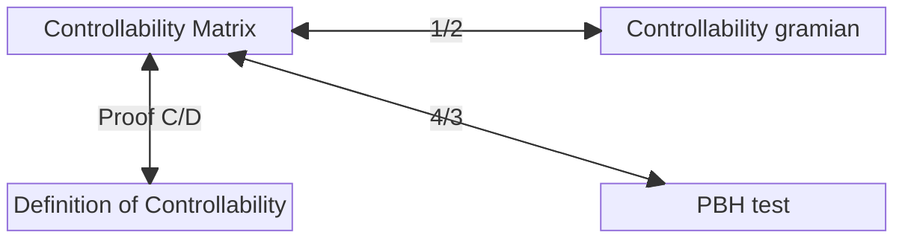

## 📢Precaution

{: .prompt-info}

> 본 게시글은 서울대학교 심형보 교수님의 23-2 제어공학개론 수업 내용을 바탕으로 작성되었습니다.

## Stability

- s-domain 상에서 2, 3사분면에 존재 : Stable
- y축 위에 존재 : Marginally(Asymptotically) Stable
- if $T(s) = 1/s^2$, initial condition만으로 발산할 수 있음. (Pole이 겹쳤을 때 solution이 $at+b$가 되는 것을 생각)

## Controllability

Controllability of a system : A, B matrix만 관여하게 됨


$$
\dot{x}=Ax+Bu \text{ is controllable for } \forall x^T\in \Re^n, \exists u(\cdot) \text{ for } [0,T] \ (T>0)
$$



$$
\text{such that }X(T)=X^T
$$


유한 시간 내에 Initial condition에 무관하게(어디에 있든지) 원하는 $X^T$(target state)로 갈 수 있다면 controllable함.

- controllable하지 않은 예시 1


$$
\dot x_1 = u, \dot x_2 = 0
$$


	$x_2$에는 손도 댈 수 없으므로, uncontrollable

- controllable하지 않은 예시 2


$$
\begin{aligned}
	\dot x_1 &= -x_1 + u \\ 
	\dot x_2 &= -x_2 + u
	\end{aligned}
$$


	각각이 $u$가 들어가므로 controllable해 보이지만, $x_1-x_2$에 $u$ term이 들어있지 않아 구분이 안됨

### How to determine Controllability

consider solution of differential eqn :


$$
X(t) = e^{At}x(0)+\int_{0}^t e^{A(t-\tau)}B u(\tau) d \tau
$$


arbitary $x^T$와, $x(0)$에 대해 위 식을 만족하는 $u(t)$를 찾아야 함.

LHS is arbitary


$$
x^T-e^{At}x(0) = \int_0^t e^{A(t-\tau)}B u(\tau) d \tau
$$


문제를 바꾸어 생각하자. 어떠한 함수 $u(t)$가 주어지면, $\Re^n$ 공간을 Mapping 할 수 있나? (즉 onto matrix인가?)


$$
\begin{aligned}
\text{let } u(\tau) = B^Te^{A^T(t-\tau)}v^* \\
\text{Eqn} = \int_0^T \bigg[e^{A(t-\tau)}BB^Te^{A^T(t-\tau)}d\tau\bigg]v^* 
\end{aligned}
$$


### Controllability Gramian


$$
\int_0^T \bigg[e^{A(t-\tau)}BB^Te^{A^T(t-\tau)}d\tau\bigg]
$$


$e^{A(t-\tau)}B$
: column vector

$B^Te^{A^T(t-\tau)}$
: row vector 의 곱으로, rank 1 (의 정보를 갖고있다고 해석?)

controllability gramian 이 invertible할 경우


$$
v^* = G^{-1}(x^T-e^{At}x(0))
$$


을 선택할 경우 모든 입력,target에 대해서 가능하다.

very sensitive to A, B

Proof )

Measurable function의 function space로부터 $\Re^n$으로의 mapping을 하는 mapping function을 L이라 하자.


$$
L(u(\cdot)) = \int_0^T F(t) u(t)dt : M^P[0,1] \rightarrow \Re^n
$$


claim : $R(L) = R(W) =span(col(W))$ s. t. $W:=\displaystyle\int_0^T F(t)F^T(t)dt$

Proof 1 : $R(W) \rightarrow R(L)$


$$
\begin{aligned}&x\in R(W), \exists z \text{ s.t. } x=Wz \\ &\text{Let } u(t) = F^T(t)z, \\ &L(u(t)) = \int_0^TF(t)F^T(t)dt \cdot z = Wz= x\end{aligned}
$$


Proof 2 : $R(L) \rightarrow R(W)$


$$
\begin{aligned}
&x\in R(L), \exists u(\cdot) \text{ s.t. } x=\int_0^T F(t)u(t)dt \\
&x = z+w, z\in R(W), \\ &v \in R(W^\perp) = N(W^T) = N(W) (\because W\text{ symmetric}) \\
&\text{by definition of } N(W), W{\bf v} = {\bf 0}\rightarrow v^TWv=0 \\
&\int_0^T v^T F(t)F^T(t)v dt = \int_0^T ||F^T(t)v||_2^2dt =0, \ \therefore F^T(t)v = 0 \\
&v^Tx = v^T \int_0^T F(t)u(t)dt = \int_0^T v^T F(t)u(t)dt = 0 \\
&\text{on the other hand, }v^Tz+v^Tv = v^Tv = 0 \\
&v^Tv = ||v||_2^2 = 0, \ \therefore v = \bf 0 \\
&x = z \in R(W)
\end{aligned}
$$


## Different definitions of controllability

- Original definition of controllability


$$
\dot{x}=Ax+Bu \text{ is controllable for } \forall x^T\in \Re^n, \exists u(\cdot) \text{ for } [0,T] \ (T>0)
$$



$$
\text{such that }X(T)=X^T
$$


- Controllability by controllability gramian


$$
\text{system (or A, B) is controllable if } G(T) = \int_0^T e^{A\tau}BB^Te^{A^T\tau}d\tau > 0
$$



$$
\text{then, } u(t) = B^T e^{A^T(t-\tau)}G(T)^{-1} \big(x^T(t)-e^{At}x(0)\big)
$$


- Controllability matrix


$$
\text{system (or A, B) is controllable if }
$$



$$
C = \bigg[B\  AB\ A^2B\ \cdots\ A^{n-1}B\bigg]\text{ has full row rank}
$$


Matlab에서 `ctrb` 함수로 호출 가능.

- PBH test


$$
rank\bigg[\lambda I - A \ B\bigg]=n \text{ for } \forall \lambda \in \text{e.v. of A}
$$


## 서로 다른 controllability 확인법이 필요충분 조건임을 확인





### Controllability matrix , Controllability gramian

1. Prove $G(T)> 0\rightarrow rank(C^T) = n$

	귀류법 사용. C가 full row rank가 아니라면, 즉 $N(C)\neq \{0\}$


$$
\begin{aligned}
	\text{for } x\in R^n, x^TC = \bf 0 \\
	\bigg[x^TB \ x^TAB \ \cdots \ x^TA^{n-1}B\bigg]=\bf 0 \\
	x^TG(T) = \int_0^T x^Te^{A\tau}BB^Te^{A^T \tau}d\tau
	
	\end{aligned}
$$


by Cayley-Hemilton’s theorem,


$$
\begin{aligned}x^Te^{A\tau}B &= \bigg[x^Tf_{n-1}(\tau)A^{n-1}B+x^Tf_{n-2}(\tau)A^{n-2}B+\cdots +x^Tf_0(\tau) IB\bigg]\\
	&= {\bf 0} (\because \text{above are linear combination of } N(C)) \\
	&x^TG(T)x = 0, G(T) \text{ is not Positive Definite matrix}\end{aligned}
$$


1. Prove $rank(C^T) = n\rightarrow G(T)>0$

	같은 방법으로 귀류법 사용


$$
\begin{aligned}
	\text{if }G(T) \text{ is singular, } &\exists x\in \Re^n \text{s.t. } x^T G(T) = {\bf 0} \\
	x^TG(T)x = 0 &\rightarrow ||x^T e^{A\tau}B||_2^2=0 \\
	\forall \tau \in[0,T],& x^Te^{A\tau}B = {\bf 0}
	\end{aligned}
$$


모든 $\tau$에 대해서 $0$을 만족하므로, 이를 $\tau$에 대해 미분한 식 또한 $0$임.


$$
x^TAe^{A\tau}B = 0, \cdots, x^TA^{n-1}e^{A\tau}B = 0
$$


위 식을 column 별로 stack 하면,


$$
x^T \bigg(B\ AB\ \cdots \ A^{n-1} B\bigg) = 0\rightarrow x^T C = 0
$$


### PBH Test, Controllability Matrix C

1. Prove $rank(C^T) = n \rightarrow rank[\lambda I - A \ B]=n$

	귀류법 사용


$$
\begin{aligned}
	&\text{if }rank[\lambda I - A \ B]<n, \text{ for }\lambda = \{\lambda_i\} \\&
	\exists v^T \text{ s.t. } v^T[\lambda^I-A\ B]={\bf 0} \\&
	v^T \lambda^ I - v^T A = {\bf 0}, v^T B = {\bf 0}
	\end{aligned}
$$


$v^T$ is left eigenvector of A


$$
v^TC=\bigg[v^TB \ v^TAB \ \cdots \ v^T A^{n-1}B\bigg] = \bigg[\bf 0 \ 0 \ \cdots \ 0\bigg] = {\bf 0}
$$


1. Prove $rank[\lambda I - A \ B]=n \rightarrow rank(C^T) = n$

	귀류법 사용


$$
\begin{aligned}
	rank(C^T) &= k< n \\
	R(C) &= span\{v_1,\cdots, v_k\}
	\end{aligned}
$$


이 때의 Basis들은 orthonormal이라고 가정하자. (항상 이러한 basis를 k개 잡을 수 있다. $rank(C^T)=k$이면)


$$
\begin{aligned}&N(C) = span\{v_{k+1}, \cdots, v_n\}
	\\ &V := \bigg[v_1, v_2\cdots, v_k , (v_{k+1}, \cdots, v_n)\bigg]= \bigg[[v_A], [v_B]\bigg]\end{aligned}
$$


Spanning set of C와 Nullspace에서 나온 basis를 구분하자.이렇게 만들어진 $V^T$로의 Simularity transform을 한 후 각각을 구분하여 Differential Eqn에 대입.


$$
\begin{bmatrix}x_A \\ x_B\end{bmatrix} = V^Tx = \begin{bmatrix}V_A^T x \\ V_B^T x\end{bmatrix}
$$



$$
V^T = V^{-1}, x = V\begin{bmatrix}x_A \\ x_B\end{bmatrix} = V_Ax_A +V_Bx_B
$$


$\dot x = Ax+Bu$에 대입


$$
\begin{aligned}
	\dot x_A &= V_A^T \dot x= v_A^T Ax+v_A^T Bu \\
	&=v_A^TA(v_Ax_A+v_Bx_B)+v_A^T Bu \\
	\dot x_B &= V_B^T \dot x= v_B^T Ax+v_B^T Bu \\ &=v_B^TA(v_Ax_A+v_Bx_B)+v_B^T Bu \\
	& \ \ \ \ \ v_B^TAv_Ax_A = 0\text{ also, }v_B^T B = 0 \\
	\because v_B\in N(C)&, Av_A \in R(C) \text{ so called A-invarient subspace} \\
	v_B^TC&=\bigg[v_B^TB ,  v_B^TAB \cdots \bigg]=0
	\end{aligned}
$$



$$
\dot x_B=0+v_B^TAv_Bx_B + 0
$$


Matrix 형태로 식을 정리해 보면,


$$
\begin{pmatrix}\dot x_A \\ \dot x_B\end{pmatrix} = \begin{bmatrix}v_A^TAv_A & v_A^T Av_B \\ v_B^TAv_A & v_B^TAv_B\end{bmatrix}\begin{bmatrix}x_A \\ x_B \end{bmatrix} + \begin{bmatrix}x_A^TB \\ x_B^TB \end{bmatrix} u
$$



$$
\begin{pmatrix}\dot x_A \\ \dot x_B\end{pmatrix} = \begin{bmatrix}v_A^TAv_A & v_A^T Av_B \\ 0 & v_B^TAv_B\end{bmatrix}\begin{bmatrix}x_A \\ x_B \end{bmatrix} + \begin{bmatrix}x_A^TB \\ 0 \end{bmatrix} u
$$


$x_A$ : controllable state, $x_B$ : uncontrollable state

Perform PBH test on Transformed coordinate (PBH test is invarient on Simularity transform)


$$
rank\bigg[\lambda I - \begin{bmatrix}v_A^TAv_A & v_A^T Av_B \\ 0 & v_B^TAv_B\end{bmatrix} \ \begin{bmatrix}x_A^TB \\ 0 \end{bmatrix}\bigg]<n
$$


	when $\lambda \in \text{e.v. of }v_B^TAv_B, \ rank<n$

## Controllability Canonical form

controllability canonical form itself is controllable (Controllability matrix를 CCF에 적용시 B의 마지막 행의 값만 0이 아니라면 C는 full row rank를 가짐)

apply simularity transform $z=T^{-1}x, \ \dot x = Ax+Bu$ to make CCF

Find T (transformation matrix) that makes CCF

$z$를 $n-1$번까지 미분할때는 그 다음 $z$가 나오다가, $n$번 미분하는 순간 $1$이 나옴.

Find column vector g


$$
\begin{aligned}\text{let } g^T[B\  AB \ \cdots A^{n-1}B] &= [0 \ 0 \ 0 \cdots 1]\\
g^T =[0 \ 0 \ 0 \cdots 1]  C^{-1 }&\in \Re^{1\times n}
\end{aligned}
$$



$$
\begin{aligned}
\text{claim : } T &= \begin{bmatrix}g^T \\ g^TA \\ g^TA^2 \\ \vdots \\ g^TA^{n-1}\end{bmatrix}
\\ z &= Tx \end{aligned}
$$



$$
z_1 = g^T x, z_2 = g^TAx, \cdots z_n = g^T A^{n-1}x
$$



$$
\dot z_1 = g^T(Ax+Bu) = g^TAx + g^T B u = z_2 + 0
$$



$$
\begin{aligned}\because g^T B &= 0 \text{ by definition of g} \\
\dot z_n = g^T A^n x + g^T A^{n-1}Bu &= \sum_{i=0}^{n-1}a_i A^i z_i + 1\cdot u\end{aligned}
$$


(Cayley-Hamilton Theorem, $A^n$을 $I, A, \cdots A^{n-1}$의 Characteristic Polynomial로 나타낼 수 있음.)
즉 위 $z_i$들을 정리하면 CCF를 얻어낼 수 있음.

## Pole-Zero Cancellation과 Controllability

State-space representation과 Transfer function의 관계


$$
\begin{aligned}
G(s) &= \frac{\text{Num}(s)}{s^n+a_{n-1}s^{n-1}+\cdots+a_0} \\
\dot x &= Ax+Bu, A\in \Re^{n\times n}
 \end{aligned}
$$


A가 $n\times n$ matrix이면 Transfer function에서의 Denom의 차수인 $n$과 같다.
Kalman Decomposition을 통해 Controllable Part-Uncontrollable part를 나누면,


$$
\begin{aligned}
\begin{bmatrix}\dot x_c \\ \dot x_{\bar c}\end{bmatrix} &= \begin{bmatrix}A_{11} & A_{12} \\ 0 & A_{22}\end{bmatrix} \begin{bmatrix}x_c \\ x_{\bar c}\end{bmatrix} + \begin{bmatrix}B_c \\ 0\end{bmatrix}u \\
\text{Let} \bar A &= \begin{bmatrix}A_{11} & A_{12} \\ 0 & A_{21}\end{bmatrix} , \bar B = \begin{bmatrix}B_c \\ 0\end{bmatrix} \\
\text{Formula of T.F.(ss2tf)} &:  \ C(sI-\bar A)^{-1}\bar B+D \\
&=C \begin{bmatrix}(sI-A_{11})^{-1} & * \\ 0 & (sI-A_{22})^{-1}\end{bmatrix}B_c+D \\
&=C (sI-A_{11})^{-1} B_c +D
\end{aligned}
$$


Uncontrollable part cancels out.

- Observability가 고려되지 않는 이유는 Observability는 $A$, $C$의 matter이기 떄문. 즉 앞에 곱해진 $C$와 $D$를 고려하면 추가로 cancel되는 부분이 unobservabable part라고 볼 수 있다.
- 즉 Pole-zero cancellation은 unobservable이거나 uncontrollable하면 일어나며, 이 때 Transfer function의 차수는 $n$차보다 작아짐. unobservable - uncontrollable eigenvector 는 서로 관련없음. 즉 $x_{oc}, x_{\bar o c}, x_{o \bar c}, x_{\bar o \bar c}$ 모두 존재가능

### Kalman decomposition

Kalman decomposition decomposes controllable/observable part


$$
\hat a = \begin{bmatrix}A_{c\bar o} & \cdots & \cdots & \cdots \\ 0 A_{co} & \cdots  & \cdots & \cdots \\ 0 & 0 & A_{\bar {co}} & \cdots \\ 0 & 0 & 0 & A_{\bar c o}\end{bmatrix}
$$


오직 $A_{co}$만이 Transfer function의 pole이 됨을 알 수 있음.

- 만약 Transfer function에 같은 term을 분자, 분모에 곱해서 강제로 Controllable c.f. 만들면 어떻게 되는가..

eg : 


$$
\text{T.F. } = \frac{2}{s-2} = \frac{2(s-1)}{(s-1)(s-2)}
$$


이 때의 우변의 T.F.를 CCF로 표현가능하나, 이 때 $s-1$에 해당하는 cancel된 pole-zero는 observability에 의한 것임을 알 수 있다.

### TF, SS중 무엇이 진짜인가?

좌표 변환 이전의 s.s가 진짜 system이라고 볼 수 있음.

T.F. 는 initial value가 고려되지 않기 때문. 이는 Laplace transform의 미분 과정에서 초깃값을 날림 물론


$$
\begin{aligned}
\dot x &= Ax \\
sX(s) -x(0) &= Ax(s)
\end{aligned}
$$


에서 $x(0)$ term을 남겨두고 T.F.를 구한다면 Initial value의 효과도 고려는 가능하다.

