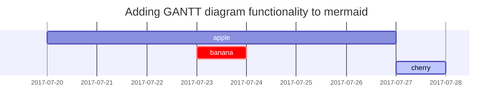

## Headings


<!-- markdownlint-capture -->
<!-- markdownlint-disable -->


# H1 — heading


{: .mt-4 .mb-0 }


## H2 — heading


{: data-toc-skip='' .mt-4 .mb-0 }


### H3 — heading


{: data-toc-skip='' .mt-4 .mb-0 }


### H4 — heading


{: data-toc-skip='' .mt-4 }


<!-- markdownlint-restore -->


## Paragraph


Quisque egestas convallis ipsum, ut sollicitudin risus tincidunt a. Maecenas interdum malesuada egestas. Duis consectetur porta risus, sit amet vulputate urna facilisis ac. Phasellus semper dui non purus ultrices sodales. Aliquam ante lorem, ornare a feugiat ac, finibus nec mauris. Vivamus ut tristique nisi. Sed vel leo vulputate, efficitur risus non, posuere mi. Nullam tincidunt bibendum rutrum. Proin commodo ornare sapien. Vivamus interdum diam sed sapien blandit, sit amet aliquam risus mattis. Nullam arcu turpis, mollis quis laoreet at, placerat id nibh. Suspendisse venenatis eros eros.


## Lists


### Ordered list

1. Firstly
2. Secondly
3. Thirdly

### Unordered list

- Chapter
	- Section
		- Paragraph

### ToDo list

- [ ] Job
	- [x] Step 1
	- [x] Step 2
	- [ ] Step 3

### Description list


Sun
: the star around which the earth orbits


Moon
: the natural satellite of the earth, visible by reflected light from the sun


## Block Quote


> This line shows the block quote.


## Prompts


<!-- markdownlint-capture -->
<!-- markdownlint-disable -->


{: .prompt-tip}


> An example showing the tip type prompt.


{: .prompt-info }


> An example showing the info type prompt. 


{: .prompt-warning }


> An example showing the warning type prompt.


{: .prompt-danger }


> An example showing the danger type prompt.


<!-- markdownlint-restore -->


## Tables


| Company                      | Contact          | Country |
| ---------------------------- | ---------------- | ------- |
| Alfreds Futterkiste          | Maria Anders     | Germany |
| Island Trading               | Helen Bennett    | UK      |
| Magazzini Alimentari Riuniti | Giovanni Rovelli | Italy   |

undefined
## Links


[http://127.0.0.1:4000](http://127.0.0.1:4000/)


## Footnote


Click the hook will locate the footnote[^footnote], and here is another footnote[^fn-nth-2].


To use : cover square brace + ^


## Inline code


This is an example of `Inline Code`.


## Filepath


Here is the `/path/to/the/file.extend`{: .filepath}.


To use : 



```text
`/file/directory/`{: .filepath}
```



## Code blocks


### Common



```text
This is a common code snippet, without syntax highlight and line number.
```



### Specific Language



```shell
if [ $? -ne 0 ]; then
  echo "The command was not successful.";
  #do the needful / exit
fi;
```



### Specific filename


{: file='_sass/jekyll-theme-chirpy.scss'}



```sass
@import
  "colors/light-typography",
  "colors/dark-typography";
```



To use :



```text
{: file='FILENAME.txt'}
```



## Mathematics


The mathematics powered by [**MathJax**](https://www.mathjax.org/):



$$
\begin{equation} \sum_{n=1}^\infty 1/n^2 = \frac{\pi^2}{6} \label{eq:series} \end{equation}
$$



We can reference the equation as \eqref{eq:series}.


When $a \ne 0$, there are two solutions to $ax^2 + bx + c = 0$ and they are



$$
x=\frac{-b\pm \sqrt{b^2-4ac}}{2a}
$$



To refer the equation :



```latex
\label{eq:series} : numbering
\eqref{eq:series} : refer, no need to enclose with \$
```



## Mermaid SVG







## Images


### Default (with caption)


{: width="972" height="589" }


_Full screen width and center alignment_


To use : 



```text
{: width="WIDTH" height="HEIGHT" }
And then Image
_CAPTION_
```



### Left aligned


{: width="972" height="589" .w-75 .normal}


To use :



```text
{: width="972" height="589" .w-75 .normal}
```



### Float to left


{: width="972" height="589" .w-50 .left}


Praesent maximus aliquam sapien. Sed vel neque in dolor pulvinar auctor. Maecenas pharetra, sem sit amet interdum posuere, tellus lacus eleifend magna, ac lobortis felis ipsum id sapien. Proin ornare rutrum metus, ac convallis diam volutpat sit amet. Phasellus volutpat, elit sit amet tincidunt mollis, felis mi scelerisque mauris, ut facilisis leo magna accumsan sapien. In rutrum vehicula nisl eget tempor. Nullam maximus ullamcorper libero non maximus. Integer ultricies velit id convallis varius. Praesent eu nisl eu urna finibus ultrices id nec ex. Mauris ac mattis quam. Fusce aliquam est nec sapien bibendum, vitae malesuada ligula condimentum.


To use :



```text
{: width="972" height="589" .w-50 .left}
```



### Float to right


{: width="972" height="589" .w-50 .right}


Praesent maximus aliquam sapien. Sed vel neque in dolor pulvinar auctor. Maecenas pharetra, sem sit amet interdum posuere, tellus lacus eleifend magna, ac lobortis felis ipsum id sapien. Proin ornare rutrum metus, ac convallis diam volutpat sit amet. Phasellus volutpat, elit sit amet tincidunt mollis, felis mi scelerisque mauris, ut facilisis leo magna accumsan sapien. In rutrum vehicula nisl eget tempor. Nullam maximus ullamcorper libero non maximus. Integer ultricies velit id convallis varius. Praesent eu nisl eu urna finibus ultrices id nec ex. Mauris ac mattis quam. Fusce aliquam est nec sapien bibendum, vitae malesuada ligula condimentum.


To use :



```text
{: width="972" height="589" .w-50 .right}
```



### Dark/Light mode & Shadow


The image below will toggle dark/light mode based on theme preference, notice it has shadows.


{: .light .w-75 .shadow .rounded-10 w='1212' h='668' }


{: .dark .w-75 .shadow .rounded-10 w='1212' h='668' }


To use :



```text
{: .light .w-75 .shadow .rounded-10 w='1212' h='668' }
Image_light
{: .dark .w-75 .shadow .rounded-10 w='1212' h='668' }
Image_dark
```



## Video





To use :



```text

```



## Reverse Footnote


[^footnote]: The footnote source
[^fn-nth-2]: The 2nd footnote source


To use :



```text
square brace + ^ name : Description
```



<script>
  window.MathJax = {
    tex: {
      macros: {
        R: "\\mathbb{R}",
        N: "\\mathbb{N}",
        Z: "\\mathbb{Z}",
        Q: "\\mathbb{Q}",
        C: "\\mathbb{C}",
        proj: "\\operatorname{proj}",
        rank: "\\operatorname{rank}",
        im: "\\operatorname{im}",
        dom: "\\operatorname{dom}",
        codom: "\\operatorname{codom}",
        argmax: "\\operatorname*{arg\,max}",
        argmin: "\\operatorname*{arg\,min}"
      },
      tags: "ams",
      strict: false, 
      inlineMath: [["$", "$"], ["\\(", "\\)"]],
      displayMath: [["$$", "$$"], ["\\[", "\\]"]]
    },
    options: {
      skipHtmlTags: ["script", "noscript", "style", "textarea", "pre"]
    }
  };
</script>
<script async src="https://cdn.jsdelivr.net/npm/mathjax@3/es5/tex-mml-chtml.js"></script>
